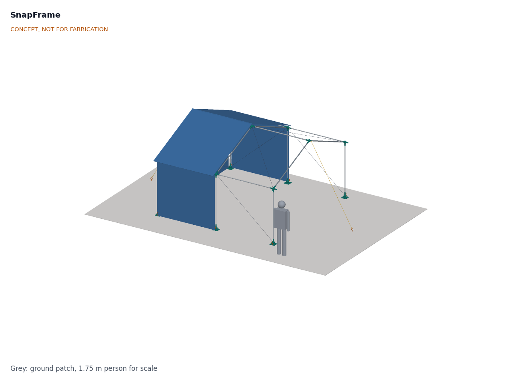

# SnapFrame

  

**Area:** Situational Field Hardware · **TRL:** 3 of 9 (proof of concept on paper) · **Prototype budget:** $400 USD for the frame kit · **Difficulty:** 2 of 5

Frame kit of standard EMT conduit joined by printed or cast nodes, with parametric nodes generated for several shelter sizes.

[Interactive 3D model](media/viewer.html) · [Concept blueprint (PDF)](media/concept-blueprint.pdf) · [General arrangement (PDF)](cad/drawings/SNF-DWG-001.pdf) · [Calculations](docs/04-calcs/01-sizing.md) · [Review note](docs/REVIEW.md)

## Concept rationale

A shelter frame has to arrive where the tarpaulins already are, go up by hand on the first day and be fixable by whoever is on site. SnapFrame therefore uses only straight, cut and drilled EMT conduit, a tube sold in hardware stores and electrical wholesalers across much of the world, and puts all the geometry into the nodes. The nodes are generated from a few parameters, so one open model gives the whole family of shelter sizes, and each node locks with the same spring button used in tent poles, so no tools, bolts or skilled labor are needed.

Keeping the design open and garage-buildable matters because relief supply chains break at the moment they are needed most. A local print farm, makerspace or small foundry can make the nodes from the published files, and a fabricator with a saw and a drill can cut the tubes, so a response does not wait for one supplier's crates or spare parts.

## Burning platform

Disasters triggered [45.8 million internal displacements in 2024, up from 26.8 million in 2023 and nearly double the annual average of the past decade](https://news.un.org/en/story/2025/05/1163176), according to the Internal Displacement Monitoring Centre, and a record 83.4 million people were living in internal displacement at the end of the year. Each of those households needs covered space quickly; the humanitarian minimum is [3.5 m² of covered living space per person](https://emergency.unhcr.org/emergency-assistance/shelter-camp-and-settlement/shelter-and-housing/emergency-shelter-solutions-and-standards).

The standard first response is still plastic sheeting. The IFRC and ICRC [shelter kit](https://itemscatalogue.redcross.int/relief--4/shelter-and-construction-materials--23/shelter-and-construction-kits--104/shelter-kit--KRELSHEK02.aspx) supplies two 4 x 6 m tarpaulins, rope, fixings and tools, but leaves the frame to local timber or bamboo, which is often scarce or already used up after a large event. The gap between a tarpaulin and a shelter that stands up to wind is a frame.

## Where it could be used

### By industry

| Industry | Use |
| --- | --- |
| Humanitarian shelter (relief agencies, NGOs) | Pre-positioned frame kits that fit existing tarpaulin stock in the first weeks after a disaster |
| Civil protection and emergency management | Mass care, reception and distribution points put up by volunteers without tools |
| Health and education in emergencies | Size L frames (about 24 m²) for temporary clinics, classrooms and child-friendly spaces |
| Events and temporary structures | Reusable shade and weather cover from one parametric kit, in place of bolted conduit frames |
| Agriculture | Shade, drying and storage shelters that later take better cladding |

### By country or region

| Country or region | Why it matters there |
| --- | --- |
| Pakistan | The 2022 floods affected [an estimated 33 million people and damaged nearly one million homes](https://news.un.org/en/story/2022/08/1125752), a scale at which local timber for frames runs out |
| Türkiye | The February 2023 earthquakes left [about 1.5 million people homeless in southern Türkiye](https://news.un.org/en/story/2023/02/1133717), with at least 500,000 new homes needed for reconstruction, so emergency shelter has to bridge years, not weeks |
| Mozambique | After Cyclone Idai in 2019, [more than 93,000 people were relocated to resettlement sites](https://www.unhcr.org/us/news/stories/one-year-people-displaced-cyclone-idai-struggle-rebuild) in the worst-affected region, and each of them needed a shelter |
| United States | A high-income example: the United States accounted for [about a quarter of the world's disaster displacements in 2024](https://news.un.org/en/story/2025/05/1163176), and EMT is stocked in hardware stores nationwide, so kits could be made near the response |

## What sparked the idea

The idea traces back to the MERO system, the "MEngeringhausen ROhrbauweise" (tube construction method) that Max Mengeringhausen developed in Germany at the end of the 1930s, in which [industrially prefabricated standard tubes join at ball-shaped nodes](https://mero.de/en/the-company/) and which became the [first space truss system used in architecture](https://en.wikipedia.org/wiki/Space_frame). MERO showed that when all the angles live in a mass-produced node, the members can be plain, identical tubes. SnapFrame takes that principle down to the scale of a family shelter: the tubes are trade-size conduit from a hardware store, the nodes are printed from a parametric model, and the screwed joints of MERO give way to spring buttons that lock by hand.

## Problem

Emergency shelters need frames that ship flat and go up without tools. Relief agencies stock standard 4 x 6 m tarpaulins, but the frame is usually left to scarce local timber, and purpose-built flat-pack shelters are costly and tied to one supplier. Design with, not for: requirements must come from co-design sessions and field trials with the intended users through a local partner.

## Concept

Frame kit of standard EMT conduit joined by printed or cast nodes, with parametric nodes generated for several shelter sizes.

The reference size M is a 4.0 x 4.0 m (16 m²) gable frame with a 2.6 m ridge: 18 straight EMT tubes (1 in rafters and ridge tubes, 3/4 in posts and eave tubes), 15 printed nodes in four variants with spring-button sockets, cable bracing, hand-turned screw anchors, and two standard tarpaulins from agency stock. The TRL 3 calculation note puts the frame kit at about 42.0 kg and $443 (10.8 % over the $400 budget) and the wind rating at about 19.7 m/s, just short of the 20 m/s target, with the 3/4 in posts governing. See the [review note](docs/REVIEW.md) for decisions and open items.

Full design precis: [docs/02-concept.md](docs/02-concept.md)

## Key components

- EMT conduit in four cut lengths: 1 in rafters and ridge tubes, 3/4 in posts and eave tubes
- Printed polymer nodes in three types (four printed variants, none handed), castable in aluminum later
- Spring snap buttons and hitch pins
- Wire-rope brace cables with hand tensioners
- Two 4 x 6 m relief tarpaulins (agency stock)
- Screw ground anchors and guy lines

The working bill of materials is in [bom/bom.csv](bom/bom.csv).

## Safety

> **Safety:** SnapFrame is an emergency shelter frame, not a storm refuge. By calculation it stays elastic with a factor of 1.5 only up to gusts of about 19.7 m/s (71 km/h), and about 14.7 m/s (53 km/h) with wind blowing into the open gable, and it is not rated for snow. Leave the shelter in storms, clear snow and standing water, keep open flames outside (polyethylene tarpaulins burn), and rate the frame for local wind and snow before relying on it.

## Repository layout

| Folder | Contents |
| --- | --- |
| `docs/` | Problem, concept, requirements, calculations and design decisions |
| `cad/src/` | build123d Python source, the source of truth for all geometry |
| `cad/step/`, `cad/stl/` | Exported models for FreeCAD, other CAD tools and printing |
| `cad/drawings/` | 2D sketches and dimensioned drawings |
| `bom/` | Bill of materials |
| `electronics/` | KiCad schematics and PCB layouts |
| `firmware/` | Microcontroller code |
| `media/` | Renders, perspectives and photos |
| `build-log/` | Dated prototyping notes |

## Documentation

Controlled documents follow the portfolio [documentation standard](.kit/STANDARDS.md). Each carries a document ID (SNF-PRC-001 for the precis), a version and a revision history. Branded PDFs are built with `python .kit/render.py` and attached to GitHub Releases when a document is tagged, for example `SNF-PRC-001/v1.0`.

## Licenses

- **Hardware** (CAD, drawings, BOM, electronics): [CERN-OHL-S v2](LICENSE)
- **Software** (firmware, scripts, notebooks): [MIT](LICENSE-SOFTWARE)

A project of the [Design Molecule](https://designmolecule.com) lab.
