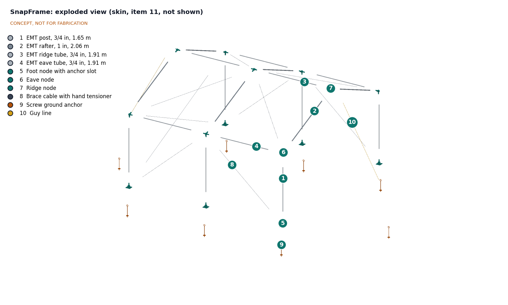

# SnapFrame design precis

SnapFrame is a gable-roof shelter frame of straight EMT conduit joined by printed nodes: 1 in EMT rafters and 3/4 in EMT posts, ridge and eave tubes. Each tube end carries a spring button that snaps into a hole in the node socket, so two adults can put the frame up by hand. The reference size M covers 4.0 x 4.0 m (16 m²) with a 2.6 m ridge and takes two standard 4 x 6 m relief tarpaulins from agency stock as its skin. The TRL 3 calculation note SNF-CAL-001 puts the frame kit at about 40.6 kg and $431 (7.8 % over the $400 budget) and rates the frame at about 17.8 m/s (64 km/h, 40 mph), short of the 20 m/s target, with the 3/4 in ridge tubes governing.

*Figure 1. SnapFrame size M with a 1.75 m person for scale. The tarpaulin skin is shown on the rear bay only, so the frame, nodes and bracing stay visible. Generated from the parametric model `cad/src/model.py`.*

## How it works

1. **Unpack.** The frame kit arrives as a strapped bundle of 18 straight tubes (four types, color-coded at the ends) and a bag with 15 nodes (three families), 10 brace cables, 8 screw anchors, 2 guy lines, buttons and hitch pins. Two tarpaulins come from agency stock.
2. **Anchor the feet.** Six foot nodes are laid out with a knotted layout cord (4.0 x 4.0 m, diagonals equal). A screw anchor is turned in by hand just outboard of each foot, using a spare tube through its eye as a lever, and the foot plate's open slot is slid onto the anchor shaft under the eye.
3. **Build the frames.** Each of the three gable frames is two posts, two rafters, two eave nodes and one ridge node. The frame is assembled flat on the ground, then walked up and its posts dropped into the foot sockets. Every joint closes with a click as the spring button finds its hole; hitch pins go in at the feet and the eave post sockets.
4. **Tie the frames together.** Ridge and eave tubes connect the three frames. Brace cables with hand tensioners go into the rear gable, one bay of each side wall and one diagonal per bay in each roof plane, and are pulled snug. Guy lines run from the two end ridge nodes to anchors 1.5 m beyond each gable.
5. **Skin.** One tarpaulin goes over the ridge as the roof; the second closes both side walls and the rear gable. The front gable stays open (R7, awaiting Amish). Tarpaulins are tied through their eyelets to the tubes, never to the nodes.
6. **Strike and reuse.** Pressing each button releases its joint. Tubes and nodes go back in the bundle and bag, or the frame stays and carries better cladding later.

## Main components

Table 1. Main components. Numbers match `bom/bom.csv`, Figure 2 and drawing SNF-DWG-001.

| # | Component | Choice | Notes |
| --- | --- | --- | --- |
| 1 | Posts (6) | 3/4 in EMT, 1.650 m | One 3.05 m (10 ft) stick each |
| 2 | Rafters (6) | 1 in EMT, 2.064 m | SNF-DDR-001 D2; second socket bore on eave and ridge nodes |
| 3 | Ridge tubes (2) | 3/4 in EMT, 1.910 m | Govern the wind rating (SNF-CAL-001) |
| 4 | Eave tubes (4) | 3/4 in EMT, 1.910 m | Same tube as item 3; different end color for the guide |
| 5 | Foot nodes (6) | Printed, one socket, 170 x 170 x 12 mm plate with an open anchor slot | About 422 g each |
| 6 | Eave nodes (6) | Printed, three or four sockets plus a cable tab | Corner nodes are handed (two right, two left); about 250 to 270 g |
| 7 | Ridge nodes (3) | Printed, three or four sockets | End nodes carry a guy tab; about 260 to 270 g |
| 8 | Brace cables (10) | 4 mm galvanized wire rope, loop ends, hand cam tensioner | 31.1 m node to node |
| 9 | Screw ground anchors (8) | 380 mm galvanized screw anchor with eye | Six at the feet, two for guys |
| 10 | Guy lines (2) | 6 mm polyester rope with slide tensioner | From end ridge nodes |
| 11 | Skin | Two 4 x 6 m reinforced polyethylene tarpaulins | Agency stock, outside the kit budget (SNF-DDR-001 D1) |
| 12 | Snap buttons and hitch pins | 36 spring buttons (one per tube end), 12 hitch pins on lanyards | Hitch pins at the 12 tension joints (SNF-DDR-001 D4) |
| 13 | Bundle straps and bag | Two cam straps for the tube bundle; one duffel bag | |

### Node concept

A node is a spherical core (84 mm diameter) with one socket per member. Each socket is 110 mm long from the node center; the tube end stops 45 mm from the center, so it engages 65 mm. The bore is the tube outside diameter plus 0.6 mm (24.0 mm for 3/4 in, 30.1 mm for 1 in) and the socket wall is 5 mm. A 6 mm spring button hole sits 25 mm from the tube end; at the feet and eave post sockets an 8 mm hitch pin hole sits 50 mm from the tube end. Socket axes are computed from the node positions, so a new width, length or pitch produces a new set of printable nodes. The prototype prints the nodes, and the printed node is intended to become a pattern for sand-cast aluminum later (SNF-DDR-001 D3); castability is not checked at TRL 3.

## Sizes

Table 2. Size family generated from the same parameters (SNF-DDR-001 D6). The model exports the node set of every size.

| Size | Floor | Bays | Eave and ridge | People at 3.5 m² each | Members | Nodes |
| --- | --- | --- | --- | --- | --- | --- |
| S | 3.0 x 3.0 m (9 m²) | 2 x 1.5 m | 1.8 m, 2.4 m | 2 | 18 | 15 (new angles) |
| M (reference) | 4.0 x 4.0 m (16 m²) | 2 x 2.0 m | 1.8 m, 2.6 m | 4 | 18 | 15 |
| L | 4.0 x 6.0 m (24 m²) | 3 x 2.0 m | 1.8 m, 2.6 m | 6 | 25 | 20 (same types as M) |

## Key numbers

All values are from SNF-CAL-001, which lists its assumptions. They are calculations on paper, not measurements.

Table 3. Geometry, mass, cost and wind, size M.

| Quantity | Value | Requirement |
| --- | --- | --- |
| Floor area | 16.0 m² | R1 met |
| Headroom 2.0 m or more | 73 % of floor | R2 met |
| Tube length in the kit | 33.7 m (54.9 m bought, 39 % offcut) | |
| Frame kit mass | 40.6 kg (90 lb); 49.8 kg with tarpaulins | R11 met |
| Packages | Tube bundle 27.4 kg, 0.029 m³; bag 22.4 kg with tarpaulins | R5 **not met** |
| Erection time | About 46 min for two adults (estimate) | R4 not verifiable at TRL 3 |
| Skin area | 51.4 m² for full enclosure; 42.6 m² with one gable open | R7 **not met** (48 m² available) |
| Frame kit cost | About $431 | R10 **not met** (7.8 % over) |
| Dynamic pressure at 20 m/s | 245 Pa | |
| Rafter (1 in) at 20 m/s | 142 N·m, 166 MPa, factor 1.66 | Meets 1.5 |
| Ridge tube (3/4 in) at 20 m/s | 106 N·m, 232 MPa, factor 1.18 | R6 **not met** |
| Post (3/4 in) at 20 m/s | 86 N·m, 188 MPa, factor 1.46 | R6 **not met** |
| Wind rating | 17.8 m/s (64 km/h, 40 mph); 13.3 m/s with the open gable facing the wind | |
| Worst foot anchor uplift | 1.28 kN at a rear corner, before pretension | R8 at risk (1.0 kN target) |
| Snow | Not rated; 0.5 kPa would put 416 MPa in a 1 in rafter | Out of scope |

The TRL 2 estimates (factor 1.70 for posts, 1.26 for 3/4 in rafters, about 18 m/s) spread half of each panel uniformly over the frames. SNF-CAL-001 uses 45° tributary lines, which peak at midspan and give higher moments. On that basis, a 3/4 in rafter would reach only 0.89.

*Figure 2. Exploded view with BOM numbers. The skin (item 11) is left out so the frame parts stay visible; items 12 and 13 are not modeled.*

## Design choices

Decided by Amish on 2026-09-25 (SNF-DDR-001):

- **Tube size (D2).** 1 in EMT rafters, 3/4 in EMT elsewhere, with the wind rating stated on the kit. SNF-CAL-001 shows this is not enough on its own to meet 20 m/s; see "Open questions".
- **Budget scope (D1).** The $400 budget covers the frame kit. Tarpaulins come from agency stock and are costed separately.
- **Node process (D3).** Print for the first prototype, design every node to be castable from the printed pattern.
- **Joint locking (D4).** Spring buttons at every tube end, hitch pins at the 12 tension joints.
- **Frame form (D5).** Gable roof with pinned nodes and cable bracing, not a dome, barrel vault or rigid nodes.
- **Sizes (D6)** S, M and L, with M as the reference, and **scope (D7)** without snow or cyclone rating in the first release.

Still proposed, awaiting Amish: tube offcuts (accept 39 %, shorten posts to 1.50 m, or buy 6 m metric stock, to decide once the first region's tube source is known), the first co-design partner and region, and how to treat the open front gable (R7).

## Safety

> **Safety:** SnapFrame is an emergency shelter frame, not a storm refuge. By calculation (SNF-CAL-001) it stays elastic with a factor of 1.5 only up to gusts of about 17.8 m/s (64 km/h, 40 mph), and about 13 m/s when wind blows into the open gable. Above that, or when a storm warning is issued, occupants should drop the skin, leave the shelter and follow local evacuation guidance. A collapsing steel frame can injure people inside.

> **Safety:** The frame is not rated for snow. Snow or ponding water on the roof can overload the rafters within hours. Clear the roof, or leave the shelter, whenever snow or standing water collects.

> **Safety:** Polyethylene tarpaulins burn quickly and drip. Keep cooking fires, candles, kerosene lamps and stoves outside the shelter or behind a non-combustible screen, keep at least 2 m between shelters where the site allows, and keep the doorway clear. A fire-retardant tarpaulin option is an open requirement (R13).

- **Erection.** Walking a frame up takes two people. Keep hands clear of sockets as tubes drop in (pinch points), and never erect or strike the frame in strong wind, when the tarpaulin acts as a sail.
- **Tube ends.** Cut EMT ends are sharp. Every tube is deburred during kit preparation, and ends sit inside sockets once assembled.
- **Guy lines and anchors.** Guy lines are a trip hazard at night; mark them with reflective tape. Screw anchors must be clear of buried cables and pipes.
- **Electrical.** The frame is conductive steel. Any lighting inside must be low-voltage DC (for example solar lanterns); mains cables must not be run on or near the frame.
- **Lightning.** A steel frame gives no reliable lightning protection. Leave it during thunderstorms where a solid building is available.

## Open questions

- R6: the 3/4 in ridge tubes (factor 1.18) and posts (1.46) fall short at 20 m/s. Options for Amish are in `docs/REVIEW.md`.
- A frame analysis with pinned nodes and tension-only cables, including post buckling, cable slack and sway.
- Confirm EMT yield strength and dimensions from supplier data for the first region, and whether metric thin-wall tube of about 25 mm is stocked where EMT is not.
- Node polymer: which printable polymer keeps its strength at 70 °C surface temperature under UV for two years (R9).
- Anchor holding capacity in sand, clay and gravel, and the rating of the hand cable tensioners (R8).
- A cutting and folding plan that closes both gables, or the case for a third tarpaulin (R7).
- Fire-retardant tarpaulin sources and cost (R13).
- Picture-only erection guide: test with users who have not seen the kit.
- Validate floor area, headroom, erection time, wind exposure and price with users through a local partner.

Drawings and media: [general arrangement SNF-DWG-001](../cad/drawings/SNF-DWG-001.pdf), [blueprint sheet](../media/concept-blueprint.pdf), [interactive 3D model](../media/viewer.html).
