# SnapFrame prototype build plan

**Plan, not yet built.** How to build the first proof-of-concept prototype, component by component. Building and testing to it is TRL 4 work. Decisions still to be made are kept in the design decisions register ([docs/06-design-decisions.md](06-design-decisions.md)), not here.

## 1. What you are building

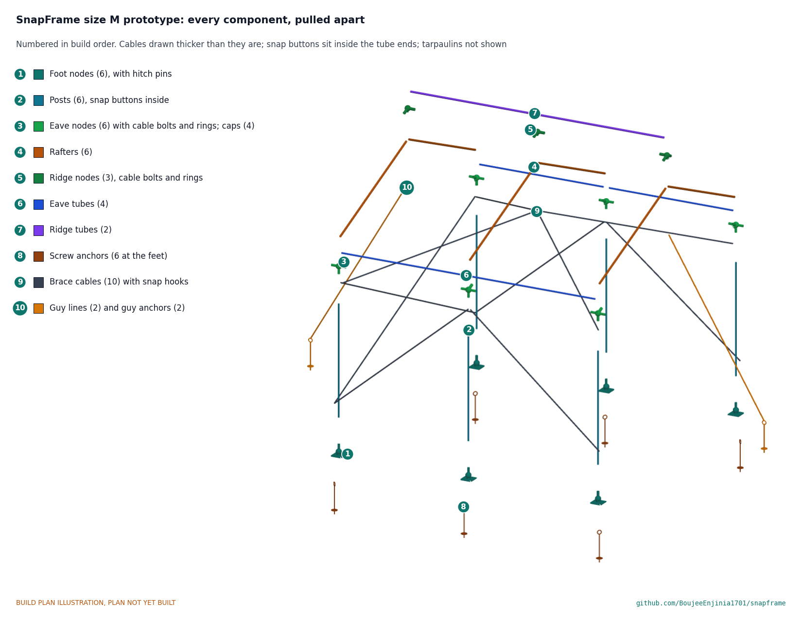

*Figure 1. Every component of the size M frame kit, pulled apart and numbered in build order. The cables are drawn thicker than they are so they show.*

The prototype is one size M SnapFrame: a gable-roofed frame 4.0 m square, 1.8 m to the eaves and 2.6 m to the ridge, made of 18 straight steel conduit tubes that click into 15 printed nylon nodes, braced with ten steel cables and held down by eight screw anchors, with three relief tarpaulins tied over it and a folding step to reach the ridge. Figure 1 shows the components in the order you make or fit them. Nine kinds are made: the foot, eave and ridge nodes (printed, then fitted with a steel cable bolt), the posts, rafters, eave tubes and ridge tubes (cut and drilled conduit), and the brace cables (made up from wire rope). The anchors, guy lines, snap buttons, hitch pins, caps, folding step and tarpaulins are bought, and the tarpaulins are cut to a plan (section 3.11). The work is sawing and drilling thin-wall tube, 3D printing, bolting, and making up wire rope ends with clips. The frame kit's parts cost about $701 from the bill of materials, most of it the printed nodes in filled nylon.

> **Safety:** The finished frame is an emergency shelter frame, not a storm refuge: by calculation it stays elastic only up to gusts of about 19.5 m/s (70 km/h), and less with the door flap open and wind blowing into it. Never put it up, take it down or fit the tarpaulins in strong wind, when the tarpaulin acts as a sail. Cut conduit ends are sharp: deburr every end and wear gloves. Raising a frame takes two people; keep fingers out of the sockets as tubes go in. Check for buried cables and pipes before turning in an anchor.

## 2. What changed to make it buildable

The concept showed what the frame does; some of its parts could not be made, fixed or put up as drawn. Each change below keeps what the frame does. The first six are recorded in decision record SNF-DDR-003 and the last four are decisions Amish made on 2026-10-02 (SNF-DEC-001); both are accepted.

*Table 1. Changes from the concept.*

| Component | The concept had | The buildable design has | Why |
| --- | --- | --- | --- |
| Tube ends | Spring button 25 mm and hitch pin 50 mm from the tube end | Button 40 mm and hitch pin 15 mm from the end (Figure 6) | The button's spring runs about 45 mm into the tube; the pin went through it |
| Sockets | Button hole straight through a 5 mm wall; square socket mouths | A 16 mm finger recess round each button hole and a chamfer at each mouth (Figure 5) | A fingertip can press the button to undo the joint, and the button rides in |
| Eave and ridge nodes | A thin printed tab for the cables on the eave nodes, pointing away from them; nothing on the middle ridge node; cables drawn through the node cores | A stainless bolt through each node with a steel ring on a spacer; every cable and guy clips into a ring (Figures 8, 9 and 13) | A printed tab would bend and break; the bolt takes any pull and the ring swings to it |
| Foot nodes | Cables drawn to the node centres; the anchor eye 32 mm above the plate; one anchor slot, straight out | The lower cable ends clip to the anchor eye; the eye is turned down onto the plate; two slots, at 45° either way (Figure 3) | The cable pull goes straight into the anchor, the plate is held from the first turn, and the gable cable passes clear of the foot |
| Erection order | Anchors first, frames dropped onto the anchored feet, then the tubes between them | Frames stand unanchored; each next frame slides 65 mm on its feet onto the tube ends; anchors go in last (steps 4 to 8) | A tube cannot be fitted between two fixed sockets that are closer together than the tube is long |
| Tube drilling | Not stated | The two button holes of every tube on opposite sides, on one marked line (Figure 4) | One drilling rule; every tube of a kind fits any position |
| Reaching the ridge | A person guiding the ridge tubes in from the ground | A folding step in the kit, used at steps 5 to 7 (Figure 1 and the pictures of those steps) | The ridge sockets are at 2.6 m and a person on the ground reaches about 2.2 m |
| Front gable | Left open as the doorway | Closed by part of a third tarpaulin with a door flap, and the corner cable hems cut in the same plan (Figure 18) | One skin that closes the whole shelter from agency stock |
| Rear corner anchors | The same anchor at every foot | A longer 560 mm anchor at each rear corner foot (Figure 3) | The gable and side wall cables both pull on that anchor: up to 1.28 kN against 1.5 kN wanted |
| Packages | One strapped tube bundle of 28.6 kg | Two tube bundles of 16.7 and 12.3 kg, and a bag (Figure 19) | Each package is 25 kg or less |

## 3. Making the components

Make and check each component before the assembly step that needs it. Sizes are in millimetres. "Inboard" means toward the middle of the shelter and "outboard" away from it; the "rear" gable is the one without a door and the "front" gable is the one with the door flap. Workshop tolerance is 1 mm on tube lengths and 0.5 mm on hole positions unless a step says otherwise; drawings do not carry tolerances before TRL 4.

### 3.1 Foot nodes (make 6)

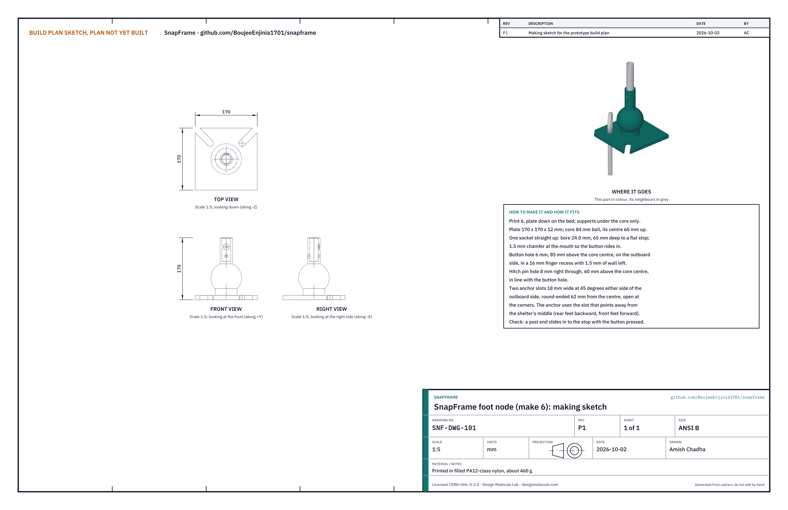

*Figure 2. Foot node making sketch (SNF-DWG-101).*

**What it is and what it is made from.** The node the bottom of each post stands in: an 84 mm ball with one socket pointing straight up, on a square plate that lies on the ground and is held down by a screw anchor. Printed in a glass- or carbon-filled nylon of the PA12 class (decided 2026-10-02, SNF-DEC-001), about 460 g each.

**How to make it.**

1. Print six, plate down on the bed, with supports under the ball only. Use the print settings that give the calculation note's assumption of about 55 % solid: four or more walls, and 40 % infill or more.
2. Let each print cool on the bed so the plate stays flat. Remove the supports and clean the socket bore.
3. Check the socket bore with a short offcut of 3/4 in conduit: it must slide in to the flat stop at the bottom of the bore without force. Ream lightly if the print is tight.
4. Check the button hole and its finger recess on the outboard side of the socket, and the hitch pin hole through the socket in line with it; clear any stringing with a 6 mm and an 8 mm drill turned by hand.
5. Check both anchor slots: 18 mm wide, open to the plate corners at 45° either side of the outboard side, round-ended 62 mm from the centre.

**How it fits the parts next to it.** A post goes into the socket until its end sits on the flat stop; its button clicks into the hole and a hitch pin goes through (Figure 6, in section 3.2). The plate lies flat on the ground on its mark. A screw anchor goes down through one slot, the one that points away from the middle of the shelter (backward at the rear feet, forward at the front feet, either at the middle feet), and its eye is turned down until it sits on the plate across the slot. The two rear corner feet take the longer anchors:

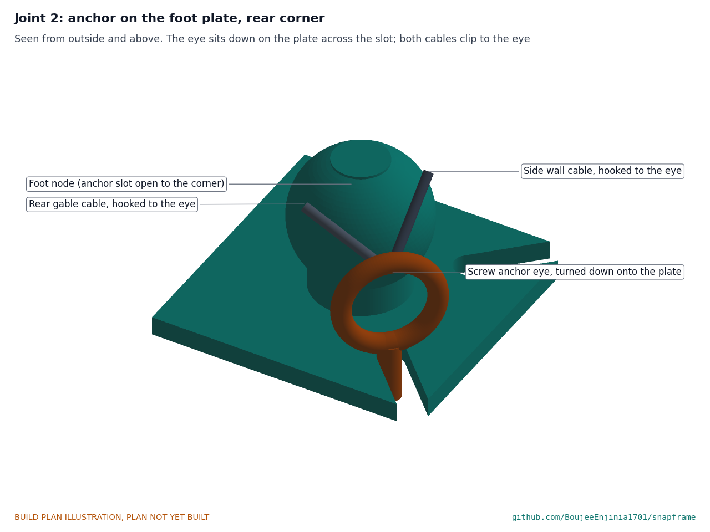

*Figure 3. The anchor eye sits down on the plate across the slot; at a corner, the gable cable and the side wall cable clip to the same eye.*

**Check before moving on.** The plate lies flat on a flat floor without rocking; a post offcut clicks in and the hitch pin goes through.

### 3.2 Posts (make 6)

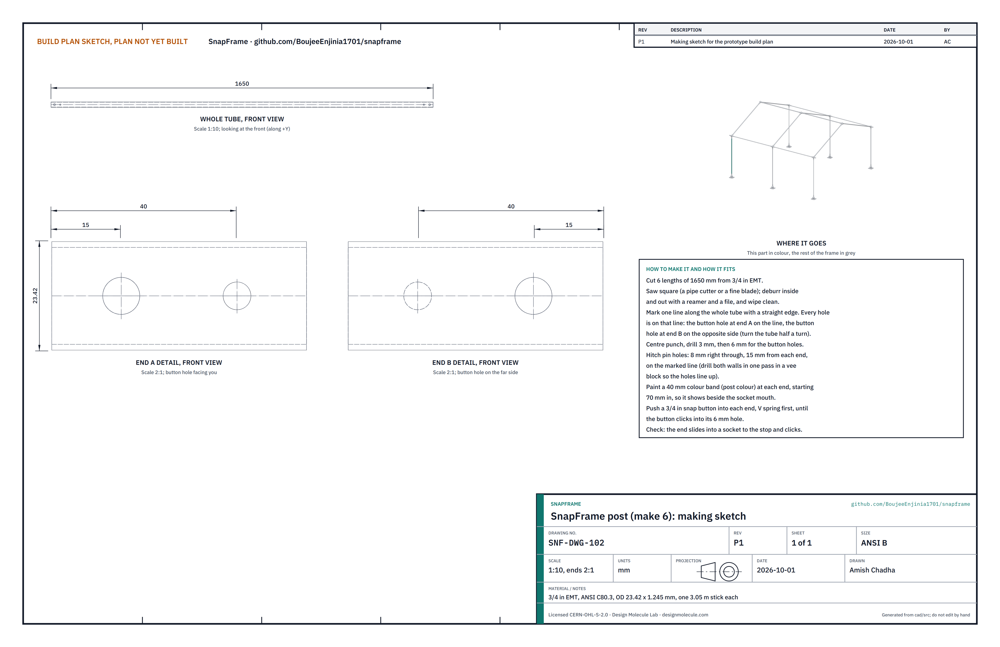

*Figure 4. Post making sketch (SNF-DWG-102): the whole tube, and both ends drawn twice full size, with the button hole facing you at one end and on the far side at the other.*

**What it is and what it is made from.** The upright at each corner and in the middle of each side wall. 3/4 in EMT conduit (23.42 mm outside, 1.245 mm wall), cut to 1,650 mm, one from each 3.05 m stick.

**How to make it.**

1. Cut six lengths of 1,650 mm, square, with a pipe cutter or a fine-tooth blade. Ream the inside and file the outside edge of each end smooth, and wipe off the swarf.
2. Lay each tube on a straight edge and draw one line along its whole length.
3. Mark the holes on the line: a hitch pin hole 15 mm from each end, and a button hole 40 mm from end A. Turn the tube half a turn and mark the button hole 40 mm from end B, on the opposite side.
4. Centre punch every mark. In a vee block, drill the hitch pin holes 3 mm, then 8 mm, straight through both walls in one pass so the two sides line up. Drill the button holes 3 mm, then 6 mm, through one wall only.
5. Deburr every hole inside and out.
6. Paint a 40 mm colour band in the post colour round each end, starting 70 mm from the end, so it shows beside the socket mouth.
7. Squeeze a 3/4 in snap button, spring first, into each end and slide it in until the button clicks out through its hole.

**How it fits the parts next to it.**

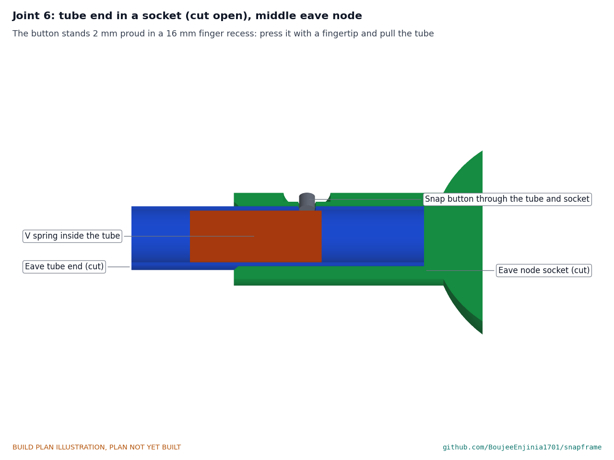

*Figure 5. Every tube end fits its socket the same way (an eave tube shown): the end sits on the flat stop, the button stands about 2 mm proud in the finger recess, and the spring lies inside the tube.*

Each end slides into its socket with the button pressed, until the end sits on the flat stop 65 mm in, and the button clicks out into the socket's hole. The bore is 0.6 mm larger than the tube, so the tube slides by hand. To undo a joint, press the button down into its recess with a fingertip and pull the tube out. Both ends of a post are pinned: a hitch pin goes through the socket and the tube 15 mm from the tube end, clear of the button's spring:

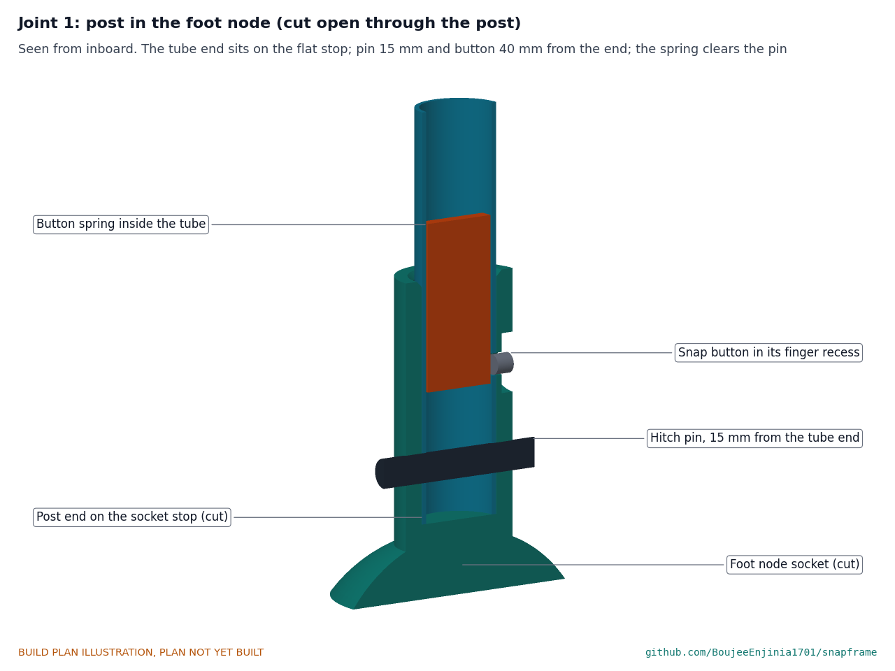

*Figure 6. The bottom of a post in the foot node, cut open through the post. The eave end is pinned the same way.*

**Check before moving on.** Lengths within 1 mm; each end clicks into a test socket and comes out by hand; both hitch pin holes take an 8 mm pin straight through.

### 3.3 Eave nodes and their cable bolts (make 6)

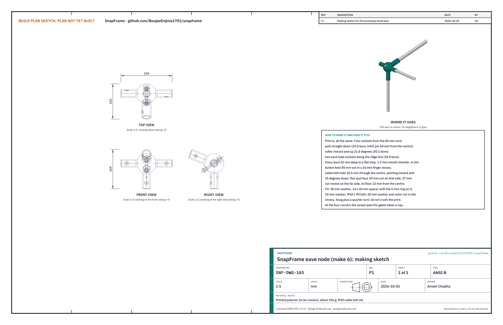

*Figure 7. Eave node making sketch (SNF-DWG-103), with its cable bolt set.*

**What it is and what it is made from.** The node at the top of each post, where the post, the rafter and the eave tubes meet. One design serves all six places: at the four corners the socket that points past the gable is left empty and capped. Printed in the same nylon, about 287 g, with a bought stainless cable bolt set through it.

**How to make it.**

1. Print six, with supports. The node measures 220 x 152 x 169 mm, so the printer bed must be at least 230 mm across.
2. Clean and check each socket as for the foot node: the post socket (straight down) and the two eave tube sockets (level, along the ridge line) take 3/4 in conduit; the rafter socket (inboard, rising 21.8°) takes 1 in conduit. The post socket has a hitch pin hole.
3. Check the cable bolt hole: 10.5 mm, straight through the ball, pointing inboard and 35° down, with a flat spot face on that side and a 27 mm recess on the far side.
4. Fit the cable bolt set from the spot face side: the 30 mm washer on the spot face, the 14 mm spacer with the 6 mm steel ring threaded on it, the 24 mm washer, then the M10 x 90 bolt through all of them and the ball. In the recess fit the 20 mm washer and the M10 nyloc nut.
5. Tighten the nut with a deep socket until snug, then a further quarter turn. Do not crush the print: the bolt clamps the washer and spacer, not the ring.

**How it fits the parts next to it.**

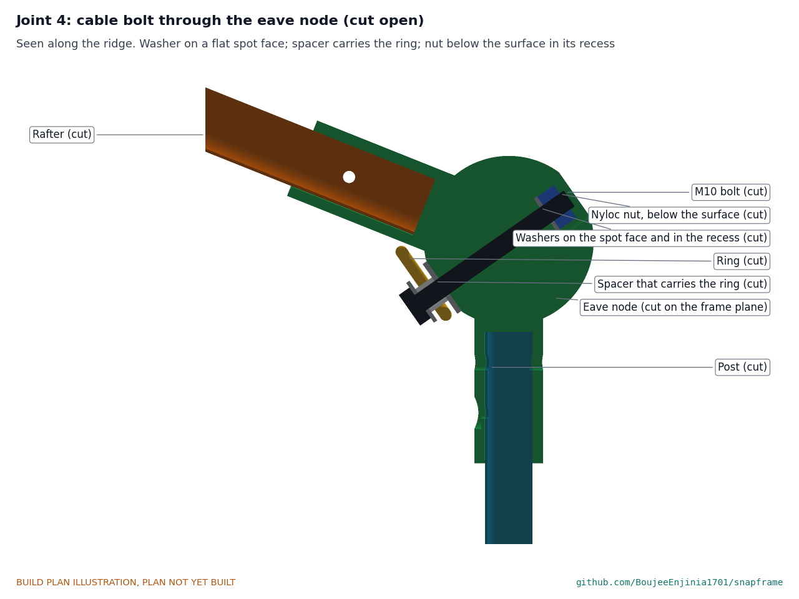

*Figure 8. The cable bolt through the eave node, cut open along the frame. The washer sits on a flat spot face, the spacer carries the ring, and the nut sits below the surface in its recess.*

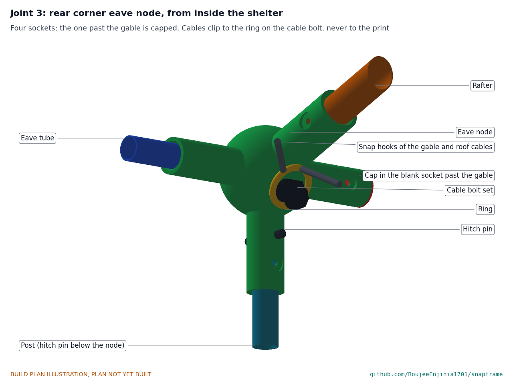

*Figure 9. A rear corner eave node: the post below (pinned), the rafter rising inboard, the eave tube along the side wall, the cap in the socket past the gable, and two cables clipped into the ring.*

The post, rafter and eave tubes click in as in Figure 5. The ring swings freely on the spacer and lines up with the cables clipped into it; the cables never touch the printed node.

**Check before moving on.** The ring swings all round the spacer by hand; nothing stands proud of the far side of the ball; every socket takes its tube to the stop.

### 3.4 Rafters (make 6)

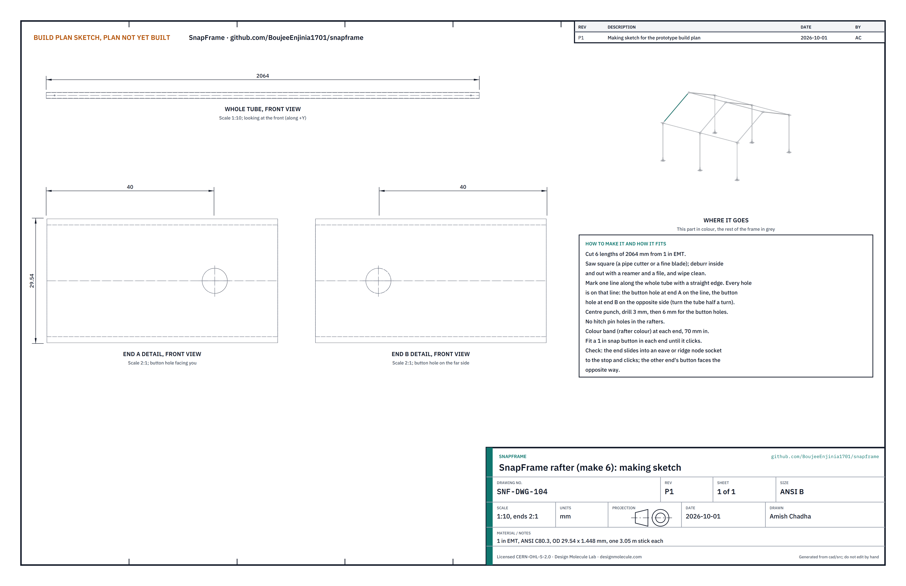

*Figure 10. Rafter making sketch (SNF-DWG-104).*

**What it is and what it is made from.** The sloping tube from each eave node up to the ridge node. 1 in EMT conduit (29.54 mm outside, 1.448 mm wall), cut to 2,064 mm, one from each 3.05 m stick.

**How to make it.**

1. Cut six lengths of 2,064 mm; ream and file both ends.
2. Draw a line along each tube; mark a button hole 40 mm from end A on the line and 40 mm from end B on the opposite side. There are no hitch pin holes in the rafters.
3. Drill 3 mm, then 6 mm, through one wall; deburr.
4. Paint the rafter colour band at each end, 70 mm in.
5. Fit a 1 in snap button in each end until it clicks.

**How it fits the parts next to it.** The low end goes into the eave node's rafter socket and the high end into a ridge node socket, as in Figure 5. With the button at the low end facing one way, the button at the high end faces the other: that is how the sockets are made.

**Check before moving on.** Length within 1 mm; both ends click into 1 in sockets.

### 3.5 Ridge nodes, end (make 2)

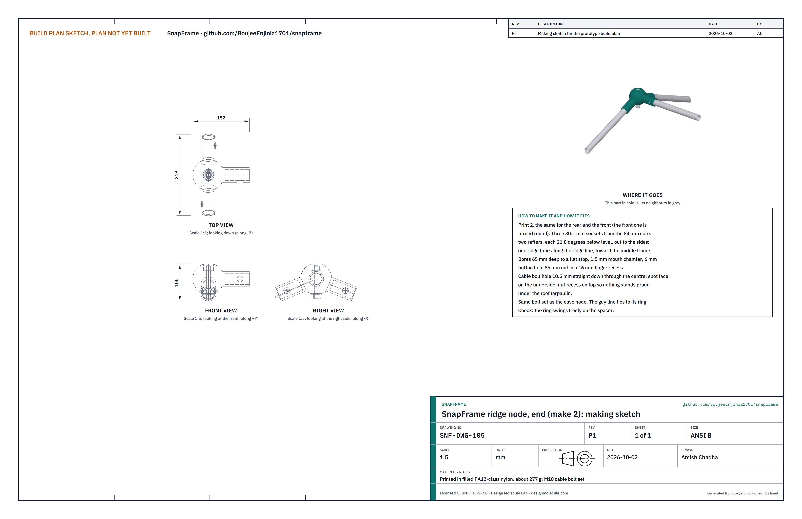

*Figure 11. End ridge node making sketch (SNF-DWG-105).*

**What it is and what it is made from.** The node at the top of the rear frame and of the front frame: two rafter sockets sloping down to the sides at 21.8° and one ridge tube socket pointing along the ridge toward the middle frame, all for 1 in conduit. The rear and front nodes are the same; the front one is turned round. Printed, about 277 g, with a cable bolt set pointing straight down.

**How to make it.**

1. Print two, with supports; clean and check each socket with a 1 in offcut.
2. Fit the cable bolt set as for the eave node (section 3.3, steps 4 and 5), from below: the spot face is on the underside and the nut recess on top, so nothing stands proud under the roof tarpaulin.

**How it fits the parts next to it.** The two rafters and the ridge tube click in as in Figure 5. The guy line for that gable ties to the ring.

**Check before moving on.** The ring swings freely; the top of the node is smooth.

### 3.6 Ridge node, middle (make 1)

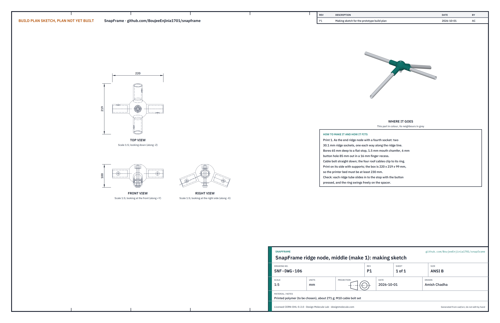

*Figure 12. Middle ridge node making sketch (SNF-DWG-106).*

**What it is and what it is made from.** As the end ridge node, with a fourth socket so that a ridge tube goes each way along the ridge. Printed, about 304 g (220 x 219 x 99 mm), with a cable bolt set pointing straight down.

**How to make it.** Print one and fit its cable bolt set as in section 3.5.

**How it fits the parts next to it.**

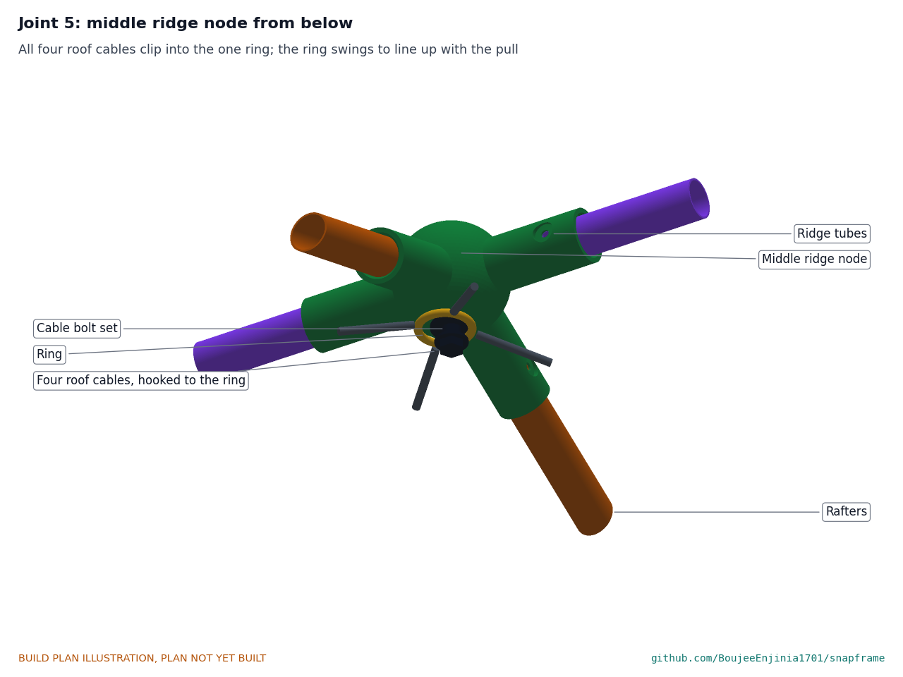

*Figure 13. All four roof cables clip into the one ring below the middle ridge node.*

**Check before moving on.** Each ridge socket takes a 1 in offcut to the stop; the ring swings freely.

### 3.7 Eave tubes (make 4)

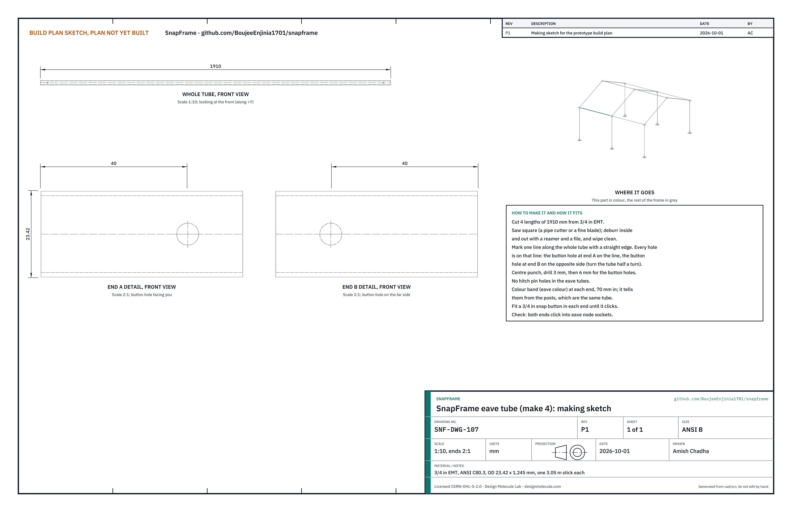

*Figure 14. Eave tube making sketch (SNF-DWG-107).*

**What it is and what it is made from.** The level tube along the top of each side wall, from eave node to eave node. 3/4 in EMT, cut to 1,910 mm.

**How to make it.** As the rafter (section 3.4) with 3/4 in conduit and length 1,910 mm: button holes 40 mm from each end on opposite sides, no hitch pin holes, the eave colour band at each end (it tells them from the posts, which are the same conduit), and a 3/4 in snap button in each end.

**How it fits the parts next to it.** Each end clicks into an eave node's level socket (Figure 5).

**Check before moving on.** Length within 1 mm; both ends click in.

### 3.8 Ridge tubes (make 2)

*Figure 15. Ridge tube making sketch (SNF-DWG-108).*

**What it is and what it is made from.** The level tube along the ridge between ridge nodes. 1 in EMT, cut to 1,910 mm.

**How to make it.** As the rafter (section 3.4), length 1,910 mm, with the ridge colour band at each end (it tells them from the rafters, which are the same conduit).

**How it fits the parts next to it.** Each end clicks into a ridge node's ridge socket (Figure 5).

**Check before moving on.** Length within 1 mm; both ends click in.

### 3.9 Brace cables (make 10)

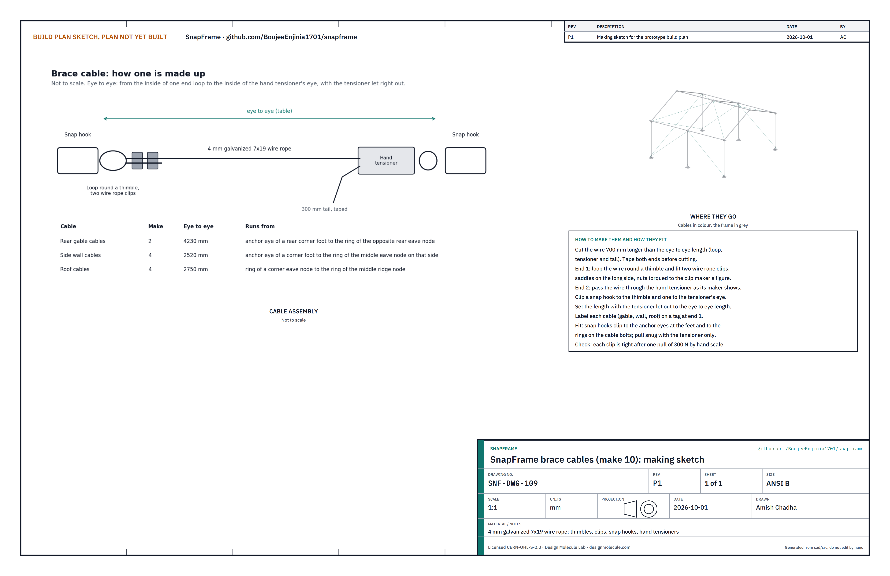

*Figure 16. Brace cable making sketch (SNF-DWG-109).*

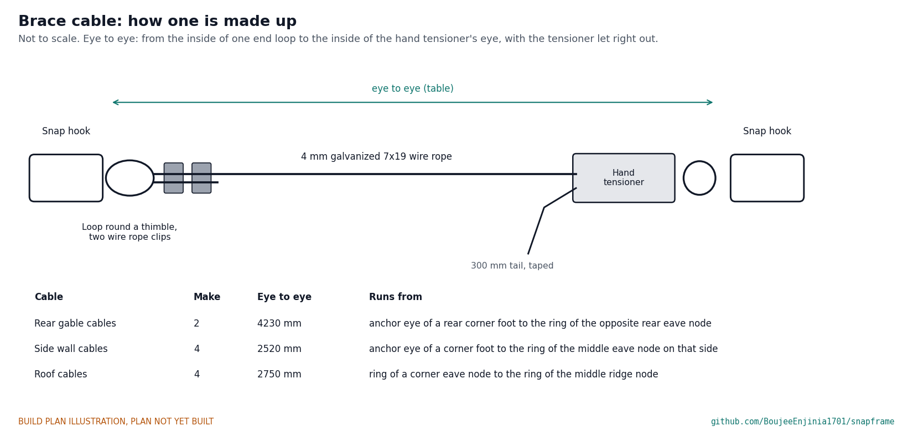

*Figure 17. One brace cable, with the three lengths needed.*

**What it is and what it is made from.** A steel wire rope with a snap hook at each end and a hand tensioner at one end, that braces the frame against wind. Ten are needed: two for the rear gable (4,230 mm eye to eye), four for the side walls (2,520 mm) and four for the roof (2,750 mm). 4 mm galvanized 7x19 wire rope, thimbles, wire rope clips, hand tensioners and snap hooks.

**How to make it.**

1. Tape the wire where you will cut it and cut each length 700 mm longer than its eye-to-eye length, to allow for the loop, the tensioner and a tail.
2. At one end, bend the wire round a thimble and fit two wire rope clips, the saddles on the long side of the wire. Tighten the clip nuts to the clip maker's figure.
3. Thread the other end through the hand tensioner as its maker shows. Set the tensioner let right out and adjust the wire so the cable measures its eye-to-eye length. Tape the tail.
4. Clip a snap hook to the thimble and one to the tensioner's eye.
5. Tag each cable "gable", "wall" or "roof" at the thimble end.

**How it fits the parts next to it.** The gable and side wall cables run from an anchor eye at a corner foot (Figure 3) up to the ring of an eave node; the roof cables run from the ring of a corner eave node to the ring of the middle ridge node (Figure 13). They are pulled snug with the tensioner only.

**Check before moving on.** Each cable within 20 mm of its eye-to-eye length; the clips do not slip when the cable is pulled to 300 N on a hand scale.

### 3.10 Bought components

Buy to specification, not brand. Line numbers are those of the bill of materials.

- **Screw anchors (line 9).** Six galvanized screw anchors about 380 mm long with a 90 mm helix and an eye of about 12 mm wire and 56 mm across, so the eye straddles the 18 mm slot. Four go at the middle and front feet, two for the guys.
- **Long screw anchors (line 16).** Two of the same design, 560 mm long, rated for 1.5 kN uplift in firm soil, for the two rear corner feet, where the gable cable and the side wall cable both pull on the eye.
- **Guy lines (line 10).** Two 3.5 m lengths of 6 mm polyester rope, each with a slide tensioner and reflective tape.
- **Tarpaulins (line 11).** Three 4 x 6 m reinforced woven polyethylene tarpaulins with eyelets, relief agency class, from agency stock. They are cut to the plan in section 3.11.
- **Snap buttons, hitch pins and caps (line 12).** 36 stainless spring snap buttons with a 6 mm button: 20 for 3/4 in conduit and 16 for 1 in conduit, each with its spring reaching no more than 45 mm beyond the button and the button standing at least 3.5 mm above the tube. Twelve 8 mm hitch pins on lanyards. Four push-in caps for the 24.0 mm corner sockets.
- **Bundle straps and bag (line 13).** Four 25 mm cam straps, two for each tube bundle, and a duffel bag of about 0.08 m³.
- **Folding step (line 15).** A light two-tread folding step of steel or aluminum, top tread 0.50 m above the floor, about 450 x 500 mm on the floor and 80 mm thick folded, about 1.5 kg, rated for 100 kg or more.
- **Cable bolt sets (line 14).** Nine sets, stainless A4-70: an M10 x 90 hex bolt with 26 mm of thread, an M10 nyloc nut, washers of 30, 24 and 20 mm outside diameter, a spacer 14 mm outside and 10 mm long, and a welded ring of 6 mm wire and 32 mm bore.
- **Snap hooks (line 8).** Galvanized or stainless, gate opening 14 mm or more so they pass over the anchor eye wire; two per cable.

### 3.11 Tarpaulins: cutting plan (cut 3 tarpaulins into 6 pieces)

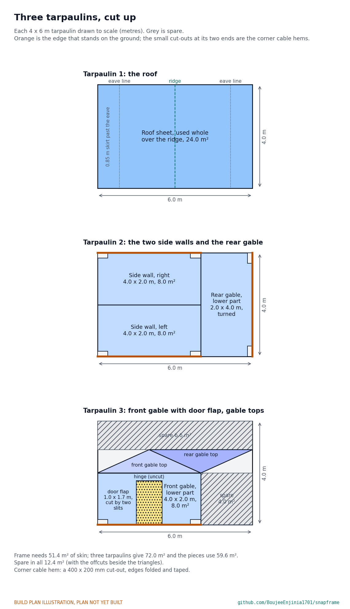

*Figure 18. Cutting plan for the three 4 x 6 m tarpaulins (SNF-DEC-001, 2026-10-02). Orange edges stand on the ground; the small cut-outs at their ends are the corner cable hems.*

**What it is and what it is made from.** The skin that closes the roof, both side walls and both gables, cut from three standard 4 x 6 m reinforced polyethylene tarpaulins from agency stock. The frame needs 51.4 m² of skin; the three tarpaulins give 72 m² and the pieces use 59.6 m² of it, leaving 12.4 m² for patches.

**How to make it.**

1. Tarpaulin 1 is not cut. It goes over the ridge as the roof, with its 6.0 m side across the slopes (the two slopes need 4.3 m, which leaves a skirt of 0.85 m past each eave) and its 4.0 m side along the ridge.
2. Cut tarpaulin 2 across the 6.0 m side into three strips of 4.0 x 2.0 m. Two are the side walls (the wall is 1.8 m high, so 0.2 m tucks under the roof sheet's skirt) and the third is the lower part of the rear gable, turned so its 4.0 m side runs across the gable.
3. From tarpaulin 3 cut a strip of 4.0 x 2.0 m for the lower part of the front gable. Mark a door flap 1.0 m wide and 1.7 m high in the middle of it, and cut the two slits from the ground edge up to 1.7 m. Leave the top of the flap uncut, as its hinge. Roll the flap up from the bottom and tie it with its eyelet ties when the door is open.
4. Also from tarpaulin 3 cut two gable tops, each a triangle with a 4.0 m base and 0.9 m height. They fit together in a 6.0 x 0.9 m strip, one pointing up and one pointing down, so cut the strip first and then cut it along the two sloping lines.
5. At the two ground corners of each of the four lower strips, cut out a corner cable hem: a rectangle of 0.40 m along the ground edge and 0.20 m up. Fold the cut edges over by 40 mm and tape them, so the anchor eye and the first part of each cable stay clear of the skin.
6. Put eyelets or reinforced tape along every edge that is tied to a tube, 0.5 m apart, and a pair of ties at each door slit.

**How it fits the parts next to it.** The gable and side wall cables leave the anchor eyes just outside the wall line and climb to the eave rings. Each leaves its hem within 0.31 m of the eye, so a 0.40 m hem is wide enough; above it the cable lies behind the skin. The pieces overlap at the eaves, the corners and the gable tops by about 0.2 m, and are tied through their eyelets to the tubes, never to the nodes or the cables.

**Check before moving on.** Each piece is within 20 mm of its size; the strips lie flat on a flat floor; the door flap rolls up and ties.

### 3.12 Packing the kit

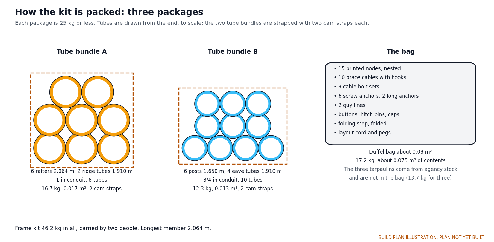

*Figure 19. The kit in three packages: two tube bundles and a bag. The tarpaulins come separately from agency stock.*

Pack the rafters (6) and ridge tubes (2) as bundle A, with two cam straps, and the posts (6) and eave tubes (4) as bundle B, with two cam straps; each is 25 kg or less. Put the nodes, cables, cable bolt sets, anchors, guy lines, hardware, folded step, layout cord and pegs in the bag. About 16.7 kg, 12.3 kg and 17.2 kg are expected; weighing them is a first check (Table 2).

## 4. Putting it together

In each picture the parts already fitted are grey and the parts being fitted are in colour, with an arrow showing the way they go in. Work with two people, in light wind only.

### Step 1: mark out the floor

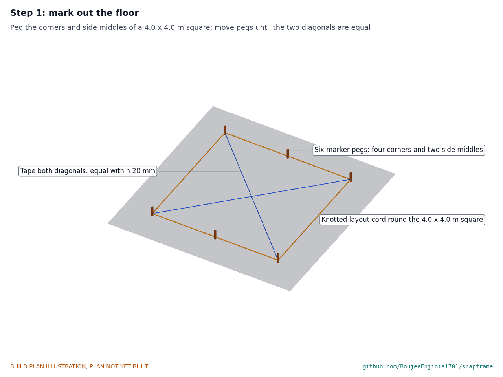

Peg the four corners and the two middles of the side walls of a 4.0 x 4.0 m square with the knotted layout cord. Measure both diagonals; move pegs until they are equal.

### Step 2: build the rear frame flat on the ground

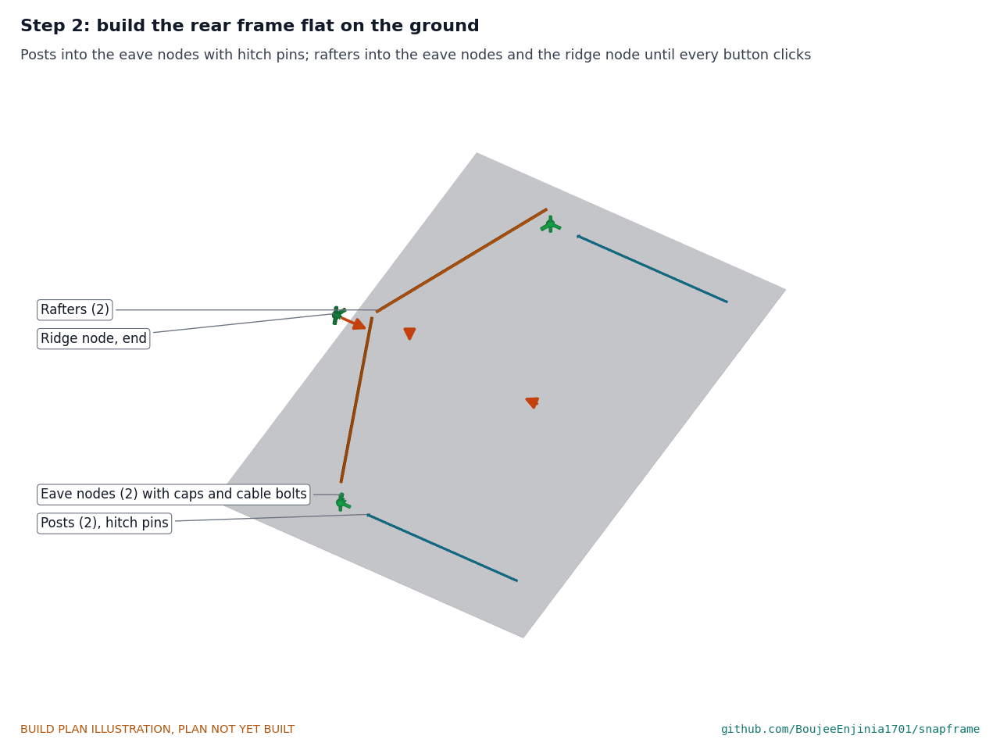

Lay the two eave nodes, two posts, two rafters and one end ridge node on the ground behind the rear pegs, as the frame will stand. Push each post into the post socket of an eave node until it clicks and put a hitch pin through. Push the rafters into the eave nodes and then into the ridge node until every button clicks. Push a cap into the socket that points away from the shelter on each eave node.

### Step 3: foot nodes onto the post ends

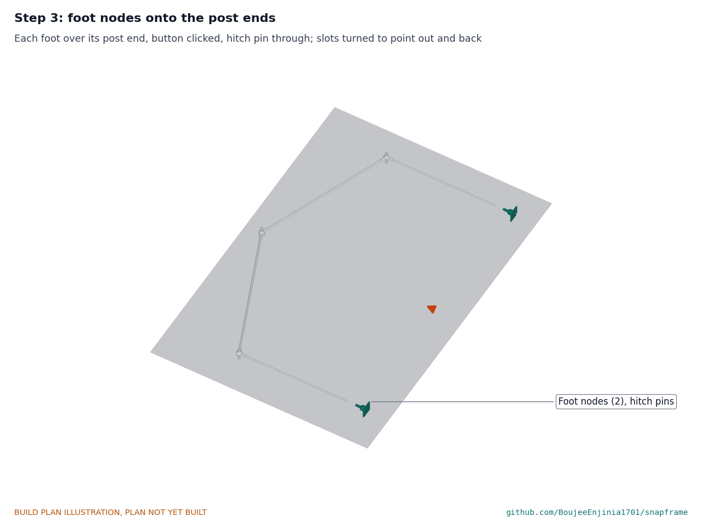

Push a foot node onto each post end until it clicks and put a hitch pin through. Turn each foot so its slots point outboard. Build the middle frame (no caps) and the front frame (with caps) the same way.

### Step 4: stand the rear frame on its marks

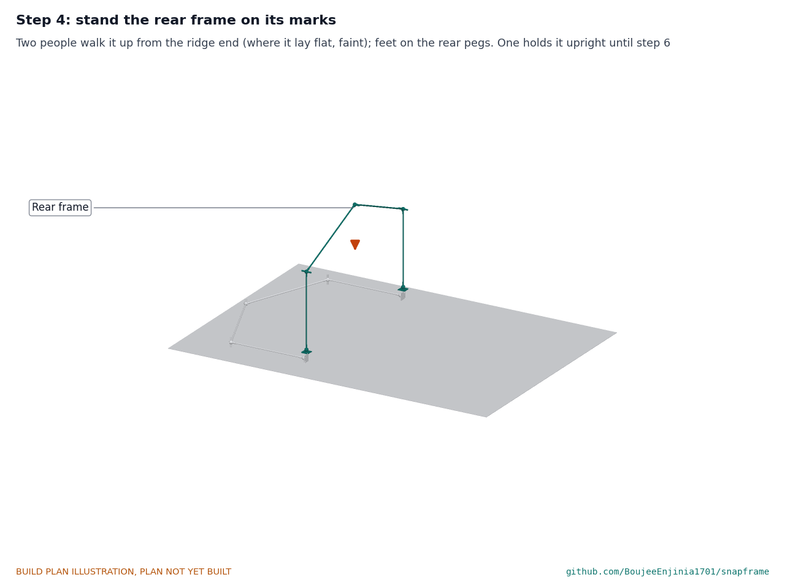

One person lifts the ridge end and walks toward the feet while the other holds the feet down; stand the frame upright with its feet on the rear pegs (pull the pegs). One person holds it upright until step 6.

### Step 5: eave tubes and ridge tube into the rear frame

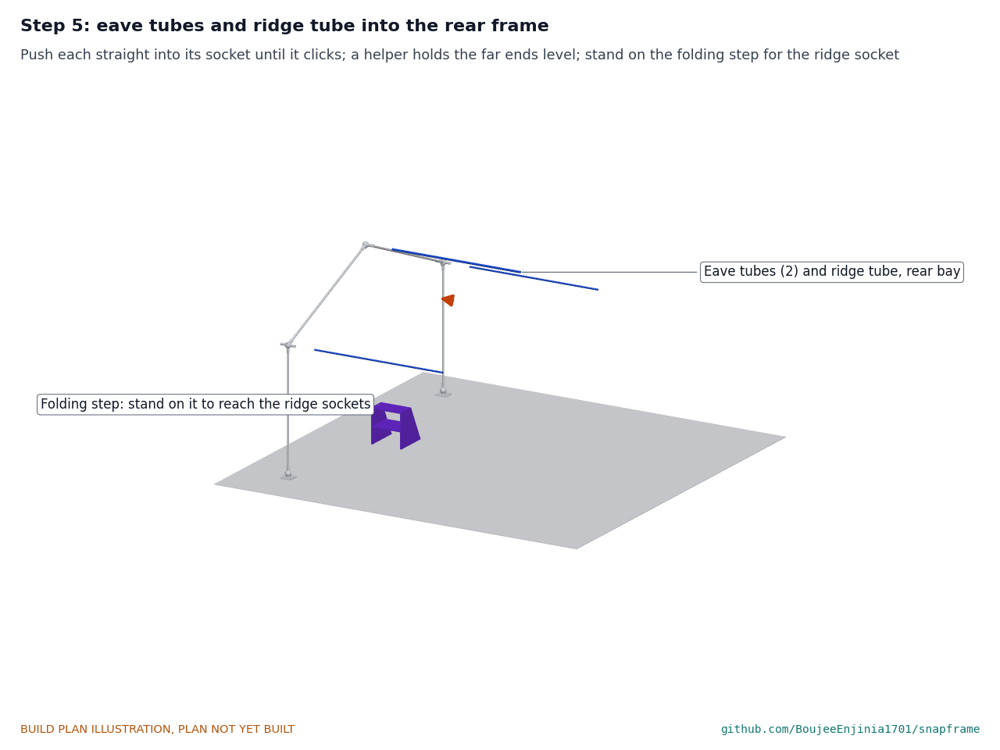

Push the two eave tubes and the ridge tube into the rear frame's sockets that point along the shelter, until each clicks. Hold the far ends level; stand on the folding step (shown in the picture) to reach the ridge socket, with one person on the step at a time.

### Step 6: slide the middle frame onto the tube ends

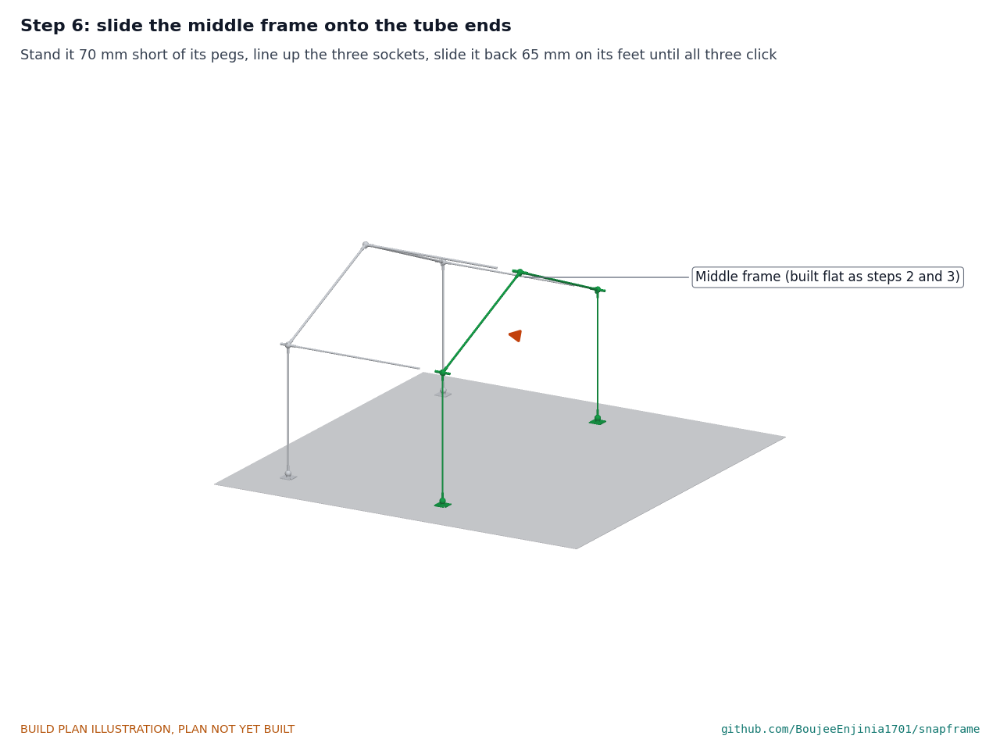

Stand the middle frame about 70 mm beyond its pegs. Line up its three sockets with the three tube ends (move the folding step under the middle ridge node), then slide the whole frame 65 mm on its feet toward the rear frame until all three buttons click. **Hold point:** all three joints clicked before anyone lets go.

### Step 7: front bay: tubes, then the front frame

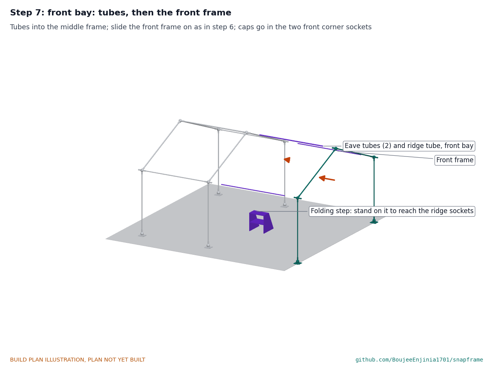

Push the front bay's two eave tubes and ridge tube into the middle frame, then slide the front frame onto them as in step 6, with the folding step moved into the front bay.

### Step 8: square the frame and turn in the anchors

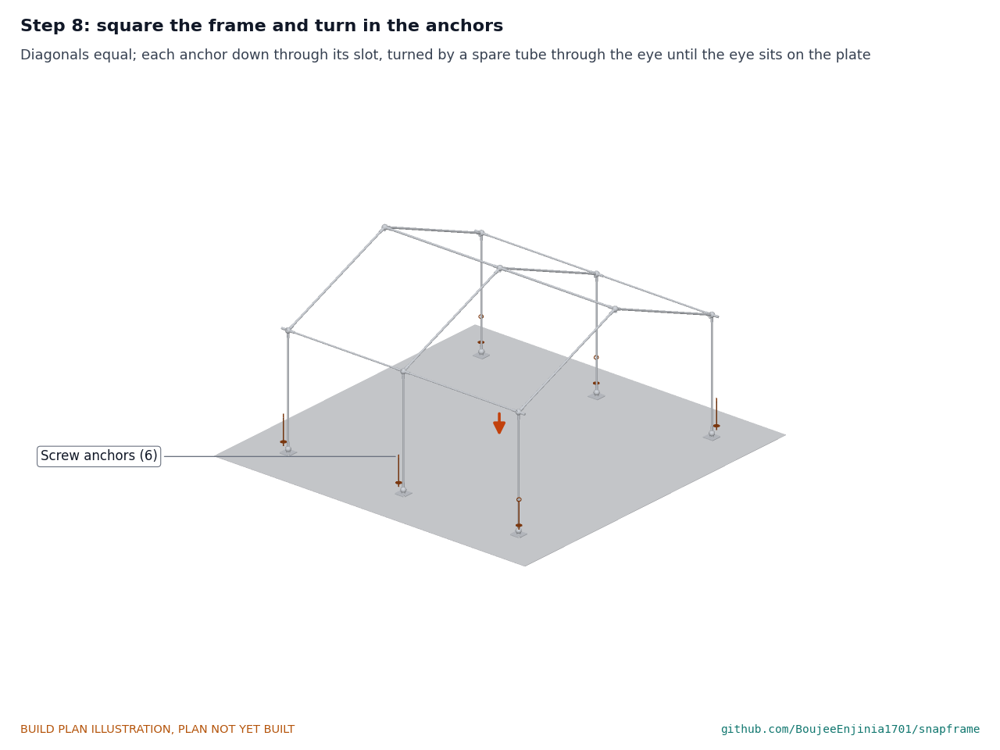

Check that both floor diagonals are equal within 20 mm; slide feet to suit. At each foot, put a screw anchor through the slot that points away from the middle of the shelter and turn it in by hand, using a spare tube through the eye as a lever, until the eye sits down on the plate across the slot. Use the two long anchors at the rear corner feet and the standard ones at the other four. **Hold point:** safety stop S4.

### Step 9: rear gable cables

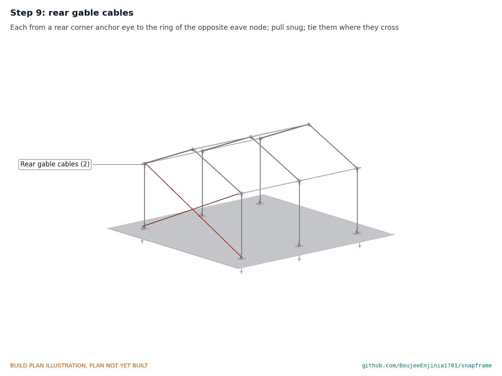

Seen from behind. Clip each gable cable's hook at the thimble end into a rear corner anchor eye and the other hook into the ring of the opposite rear eave node. Pull both snug with their tensioners, evenly, and tie them together with a cable tie where they cross.

### Step 10: side wall cables

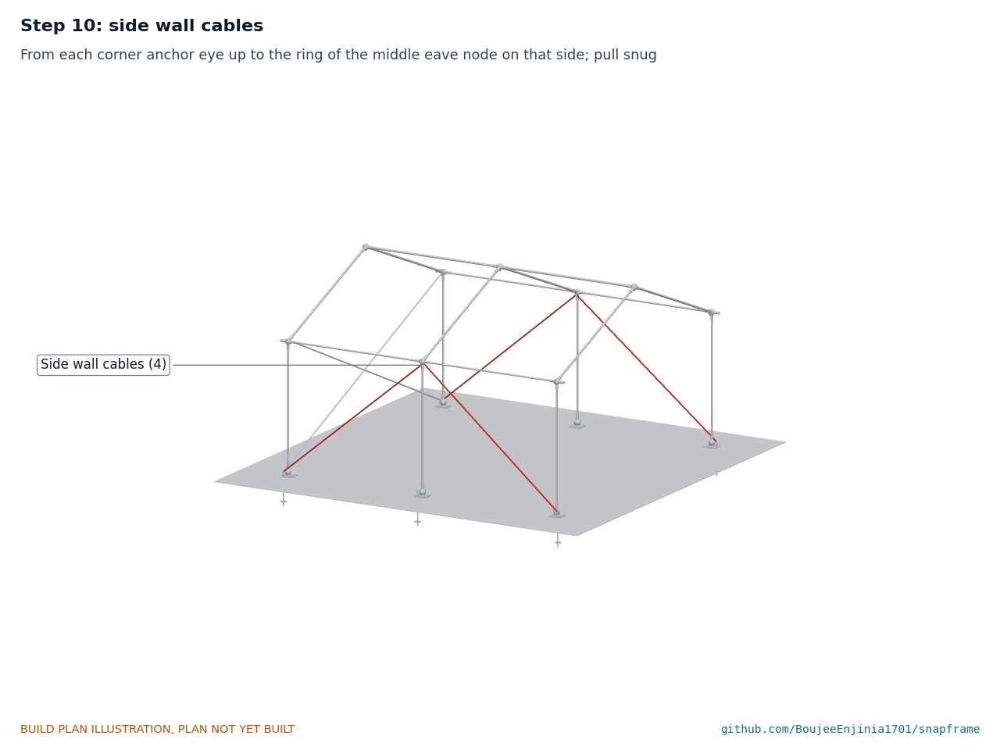

On each side, clip a wall cable from each corner anchor eye up to the ring of the middle eave node on that side. Pull snug.

### Step 11: roof cables

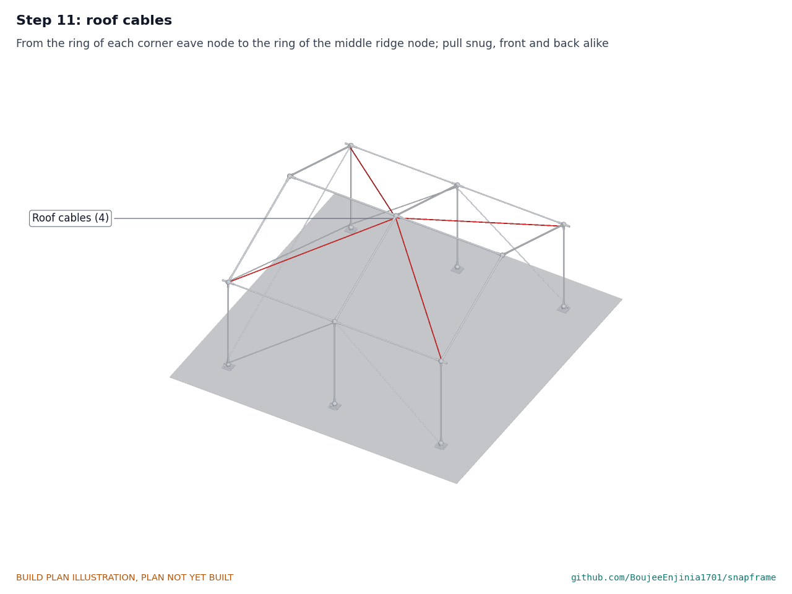

Clip a roof cable from the ring of each corner eave node to the ring of the middle ridge node. Pull all four snug, front and back alike, so the ridge stays straight.

### Step 12: guy anchors and guy lines

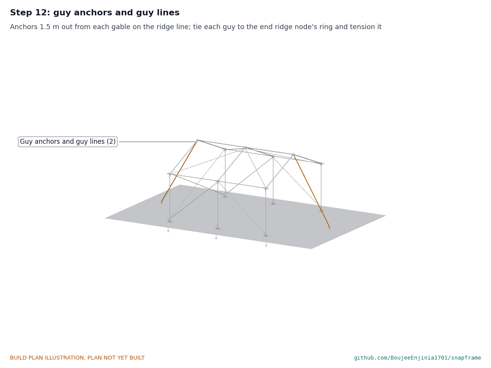

Turn in a guy anchor on the ridge line 1.5 m out from each gable. Tie each guy line to the ring of its end ridge node and to the guy anchor, and tension it with its slide tensioner. **Hold point:** safety stop S5.

### Step 13: tarpaulins

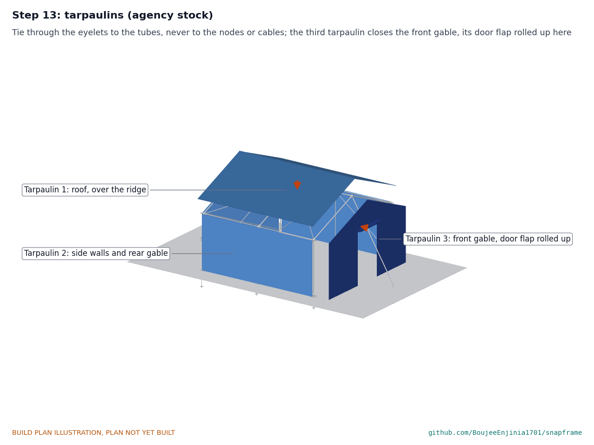

Throw the first tarpaulin over the ridge as the roof. Hang the three strips of the second on the two side walls and the rear gable, and the front gable strip of the third, with its door flap, across the front. Tie the gable tops in above them. Tie everything through the eyelets to the tubes, never to the nodes or the cables, with the corner cable hems round the anchor eyes (Figure 18). Roll the door flap up and tie it when the door is open. **Hold point:** safety stop S6.

## 5. First checks

These are the checks a TRL 4 test report would record; this plan only lists them. Requirement numbers are those of SNF-REQ-001.

*Table 2. First checks.*

| Check | Requirement | How | Pass when |
| --- | --- | --- | --- |
| Floor and squareness | R1 | Tape the sides and diagonals between the foot centres | 4.0 x 4.0 m within 20 mm; diagonals equal within 20 mm |
| Headroom | R2 | Measure from the floor to the underside of the rafters across the span | 2.0 m or more over the middle 2.9 m |
| Joints by hand | R4, R12 | Undo and remake one joint of each tube type with a fingertip only | Each button presses flush and the tube comes out and clicks back without tools |
| Part replacement | R12 | Replace one post and one rafter in the standing frame | Each in 5 minutes or less |
| Anchors | R8 | Pull one middle or front anchor and one long rear corner anchor up with a hand scale or a lever and scale | The standard anchor holds 1.0 kN and the long one 1.5 kN; record the soil |
| Cables | R6 | Pull each cable to about 300 N with its tensioner and a hand scale | No clip or tensioner slips; the frame stands plumb |
| Frame stiffness | R6 | Push sideways at an eave node and along the ridge with about 100 N | The frame moves a little and returns; no joint opens |
| Tarpaulin fit | R7 | Cut and fit the three tarpaulins as section 3.11 and step 13 | Roof, both side walls and both gables closed; the door flap opens and ties |
| Mass and packages | R5, R11 | Weigh the two tube bundles and the bag | Bundles about 16.7 and 12.3 kg, bag about 17.2 kg (all recorded), each 25 kg or less |
| Erection time | R4 | Two adults who have not seen the kit, with the picture guide | Frame and skin up in 60 minutes or less |

## 6. Safety stops

Stop at each point. Carry on only when everything listed is true.

- **S1. Before cutting and drilling.** Safety glasses on; tube clamped in a vice or vee block, never held by hand under the drill; gloves for handling cut ends.
- **S2. Before printing.** The printer is in a ventilated space or has a filtered enclosure; nylon and other engineering polymers give off fumes while printing.
- **S3. Before a frame is stood up.** Every button clicked and every hitch pin in; two people; wind light (no tarpaulin on the frame). The folding step stands level on firm ground with one person on it at a time.
- **S4. Before any anchor is turned in.** The site is checked for buried cables and pipes with whoever owns them; no anchor within 0.5 m of a marked service.
- **S5. Before the cables and guys are tensioned.** Gloves on; nobody stands in line with a cable while it is being tensioned; tensioners pulled by hand only, never with a bar; guy lines marked with reflective tape.
- **S6. Before the tarpaulins go on.** All anchors, cables and guys fitted and tensioned; wind light. A tarpaulin on an unbraced frame is a sail.
- **S7. Before anyone shelters in it (outside this plan).** The wind rating (about 19.5 m/s, and about 14.7 m/s with the door flap open and wind blowing into it) is posted on the frame; no snow or standing water on the roof; cooking and open flames kept outside; at least 2 m to the next shelter where the site allows; low-voltage lighting only.

## 7. Tools, skills and workspace

**Tools.** Pipe cutter for 3/4 in and 1 in conduit, or a hacksaw with a 32 teeth per inch blade; inside reamer and flat file; tape measure, steel rule, marker, a 2 m straight edge (a length of aluminium angle) for the hole line, and a centre punch; bench drill or a drill in a stand, with a vee block and drills of 3, 6 and 8 mm; deburring tool; 3D printer with a bed of at least 230 mm and a hardened nozzle that prints glass- or carbon-filled PA12-class nylon (or a print farm); 16 or 17 mm spanner and a deep socket that fits a 27 mm recess; wire rope cutters and a 10 mm spanner for the rope clips; hand scale to 50 kg; knotted layout cord and six pegs; the folding step (line 15); a sharp knife or hot knife and a straight edge for cutting the tarpaulins, and a punch or eyelet tool; gloves and safety glasses.

**Skills.** No certified trade is needed. Basic metalwork (measuring, cutting and drilling thin-wall tube), running a 3D printer, bolting, and making up wire rope ends with clips. No electrical work is part of this build.

**Workspace.** A bench about 2.5 m long for the tubes, or two trestles; a ventilated place for the printer; and a flat, open site at least 8 x 7 m clear of overhead lines and buried services for the first erection, including the guy anchors 1.5 m beyond each gable.

**Personal protective equipment.** Safety glasses for cutting, drilling and anchor work; cut-resistant gloves for conduit ends and wire rope; hearing protection when sawing; no gloves near a turning drill.

## 8. Where the numbers come from

- Model and constructability checks: `cad/src/model.py` (`python cad/src/model.py --check`, 214 checks); STEP and STL exports in `cad/step/` and `cad/stl/`.
- Pictures: `cad/src/build_plan_media.py`, using `.kit/build_views.py`; written to `docs/05-build-plan/` and `cad/drawings/SNF-DWG-101` to `SNF-DWG-109`. The cutting plan is checked by `cad/src/skin_plan.py` (19 checks).
- General arrangement: `cad/drawings/SNF-DWG-001.pdf`, Rev P5.
- Calculations: `docs/04-calcs/01-sizing.md` (SNF-CAL-001 v0.6) and `docs/04-calcs/sizing.py`; frame analysis, section 5; cable bolt and hitch pin, section 6; masses and costs, section 7; skin, section 8.
- Bill of materials: `bom/bom.csv` and `bom/bom-notes.md`.
- Decisions: `docs/decisions/0003-design-for-construction.md` (SNF-DDR-003), with SNF-DDR-001 and SNF-DDR-002; open items in `docs/06-design-decisions.md` (SNF-DEC-001).
- Requirements: `docs/03-requirements.md` (SNF-REQ-001 v0.8).
